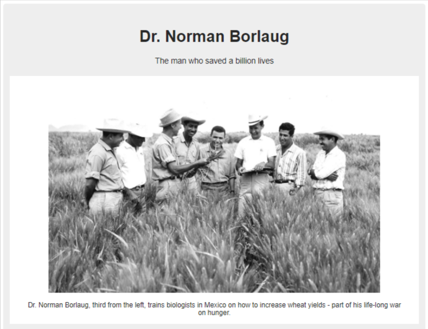
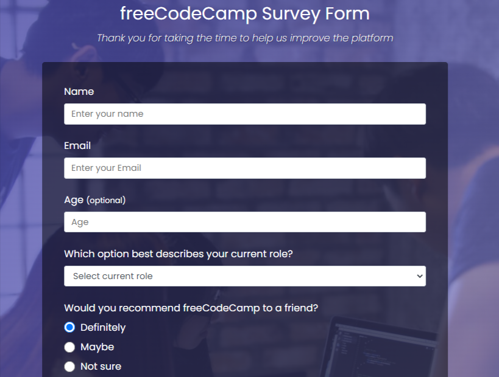
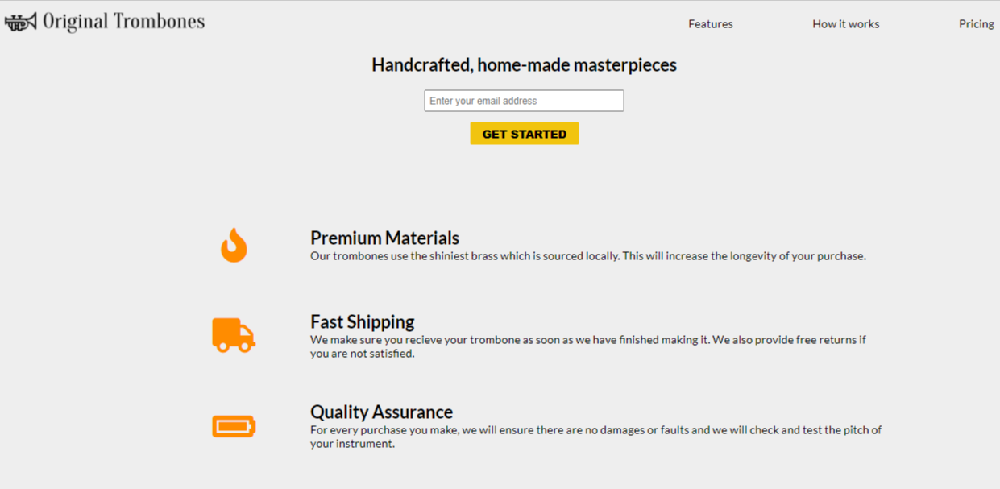
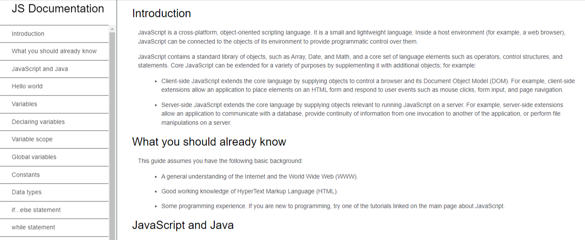
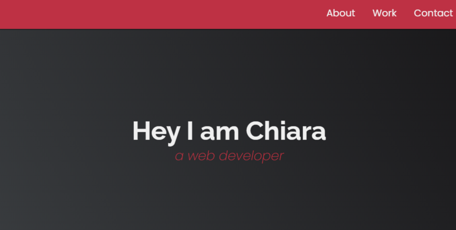

# Projects from freeCodeCamp

Final projects from the interactive learning web platform [freeCodeCamp](https://www.freecodecamp.org/).

## Responsive Web Design

[Verified Certificate](https://www.freecodecamp.org/certification/chiarass/responsive-web-design)

### Tribute Page - Project 1 (Built with HTML and CSS)

[Live Site URL](https://chiarastef.github.io/freeCodeCamp-projects/responsive-web-design/project-1/)

#### Screenshot

### Survey Form - Project 2 (Built with HTML and CSS)

[Live Site URL](https://chiarastef.github.io/freeCodeCamp-projects/responsive-web-design/project-2/)

#### Screenshot

### Product Landing Page - Project 3 (Built with HTML, CSS and Flexbox)

[Live Site URL](https://chiarastef.github.io/freeCodeCamp-projects/responsive-web-design/project-3/)

#### Screenshot

### Technical Documentation Page - Project 4 (Built with HTML, CSS and Position)

[Live Site URL](https://chiarastef.github.io/freeCodeCamp-projects/responsive-web-design/project-4/)

#### Screenshot

### Personal Portfolio Webpage - Project 5 (Built with HTML, CSS, Flexbox and Grid)

[Live Site URL](https://chiarastef.github.io/freeCodeCamp-projects/responsive-web-design/project-5/)

#### Screenshot

## JavaScript Algorithms and Data Structures

[Verified Certificate](https://www.freecodecamp.org/certification/chiarastef/javascript-algorithms-and-data-structures)

### Palindrome Checker

[Code](https://github.com/chiarastef/freeCodeCamp-projects/blob/main/javascript-algorithms/palindrome-checker.js)

### Roman Numeral Converter

[Code](https://github.com/chiarastef/freeCodeCamp-projects/blob/main/javascript-algorithms/roman-numeral-converter.js)

### Caesars Cipher

[Code](https://github.com/chiarastef/freeCodeCamp-projects/blob/main/javascript-algorithms/caesars-cipher.js)

### Telephone Number Validator

[Code](https://github.com/chiarastef/freeCodeCamp-projects/blob/main/javascript-algorithms/telephone-number-validator.js)

### Cash Register

[Code](https://github.com/chiarastef/freeCodeCamp-projects/blob/main/javascript-algorithms/cash-register.js)

## Author

Chiara Stefanelli - Front-End Development Student based in Italy

- Website - [Chiara Stefanelli](https://chiarastefanelli.netlify.app/)
- LinkedIn - [Chiara Stefanelli](https://www.linkedin.com/in/chiarastefanelli/?locale=en_US)
- freeCodeCamp profile - [Chiara Stefanelli](https://www.freecodecamp.org/chiarastef)
